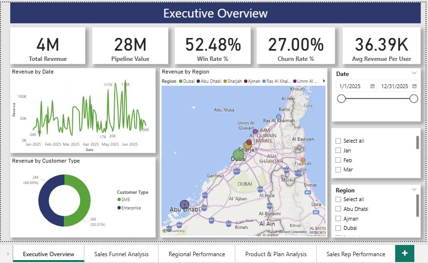

# Telecom Sales Data Analysis (Power BI Project)

## Project Overview
This project analyzes telecom sales data to identify key revenue drivers, sales pipeline performance, and regional sales efficiency.

The dashboard helps management make data-driven decisions to improve sales performance.

## Business Problem
Telecom companies generate large sales pipelines but struggle to convert opportunities into revenue efficiently.

This project analyzes the sales pipeline to answer key questions:
- Which region generates the highest revenue?
- Which sales reps have the highest win rate?
- Which sales stages cause deal loss?
- How pipeline value converts into revenue

## Tools Used
Power BI  
Excel  
DAX  
Data Modeling  

## Dataset
The dataset contains telecom sales opportunity data including:

- Sales Rep
- Region
- Product
- Deal Value
- Sales Stage
- Deal Status
- Pipeline Value
- Won Revenue

## Dashboard Features

KPIs:
- Total Revenue
- Pipeline Value
- Win Rate %
- Deals Won
- Deals Lost

Visuals:
- Sales Funnel by Stage
- Revenue by Region
- Sales Rep Performance
- Product Performance
- Pipeline vs Revenue

## Key Insights

1. Dubai is the top revenue generating region.
2. Some regions show high pipeline but low conversion rates.
3. A few sales reps drive majority of the revenue.
4. Certain products dominate telecom sales revenue.

## Business Recommendations

- Allocate top sales reps to high value pipeline regions
- Improve follow-up strategies in negotiation stage
- Focus on high converting products

## Dashboard Preview

## Author
Munira Ratlaami  

Aspiring Data Analyst | Power BI | Data Visualization
